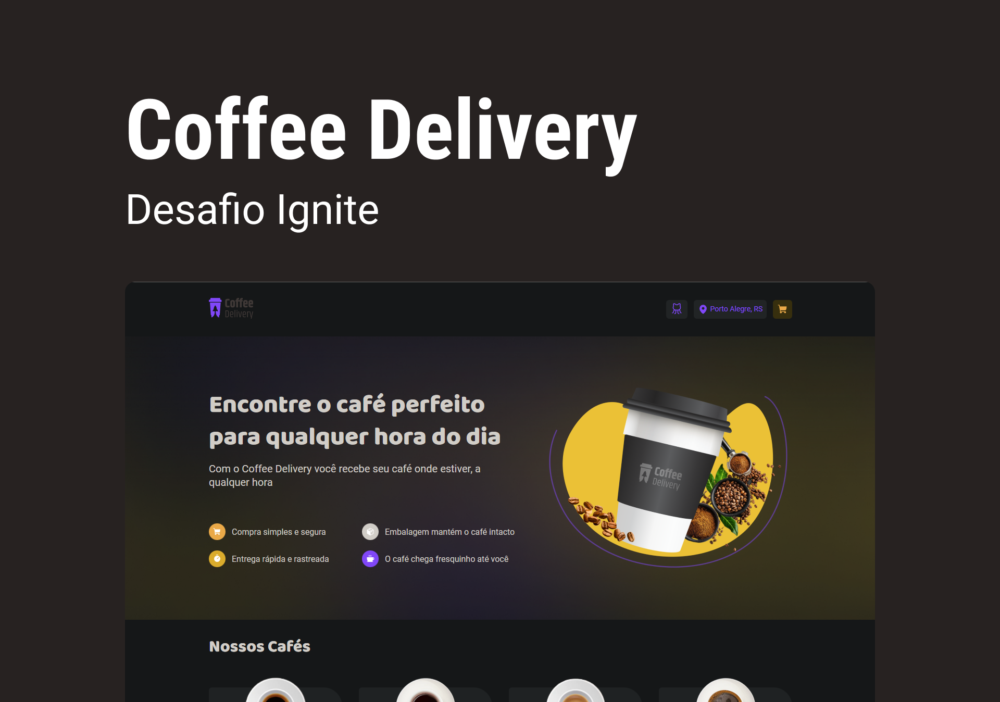

  
  <a href="https://github.com/Rafeso/coffee_delivery/commits/master">
    
  </a>
    
   
   <a href="https://github.com/Rafeso/coffee_delivery/stargazers">
    
  </a>

  <a href="https://www.linkedin.com/in/rafael-feitosa-618472241/">
    
 </a>

<h1 align="center">
    ☕ Coffee Delivery ☕
</h1>

<h4 align="center"> 
	✔  Coffee Delivery 🚀 Concluído  ✔
</h4>

<p align="center">
 <a href="#-sobre-o-projeto">Sobre</a> •
 <a href="#-funcionalidades">Funcionalidades</a> •
 <a href="#-layout">Layout</a> • 
 <a href="#-como-executar-o-projeto">Como executar</a> • 
 <a href="#-tecnologias">Tecnologias</a> • 
 <a href="#-autor">Autor</a> • 
 <a href="#user-content--licença">Licença</a>
</p>

<br>

<h1 align='center'> 💻 Sobre o projeto </h1>

<p align='center'>☕ Coffee Delivery ☕</p>

Projeto desenvolvido durante o bootcamp **Ignite** oferecido pela [Rocketseat](https://lp.rocketseat.com.br/ignite).
O Coffee Delivery foi desenvolvido no segundo módulo da trilha como um desafio sobre os conceitos de SPA e Context API.

---

## ⚙️ Funcionalidades

- [x] Os usuários podem:
  - [x] Adicionar um ou mais cafés ao carrinho.
  - [x] Preencher um formulário para a entrega do pedido.
  - [x] Concluir um pedido.

---

<h1 align='center'> 🖌💻 Layout e Web </h1>

<p align="center" style='display:flex; gap:1rem;'>
  
  
</p>

<div style="display: flex; gap: 0.5rem;">
  <a href="https://www.figma.com/file/7D5IMTlZVkxDVMw6EbIFrC/Coffee-Delivery-(Copy)?node-id=11%3A599&t=zirkuMMM7MPHqOky-1">
    
  </a>
  <a href="https://coffe-delivery-r.vercel.app/">
    
  </a>
</div>

---

## 🚀 Como executar o projeto

### Pré-requisitos

Antes de começar, você vai precisar ter instalado em sua máquina as seguintes ferramentas:
[Git](https://git-scm.com), [Node.js](https://nodejs.org/en/).

**Instale a versão LTS do Node.JS**

Além disto é bom ter um editor para trabalhar com o código como [VSCode](https://code.visualstudio.com/)

#### 🧭 Rodando a aplicação web

```bash

# Clone este repositório
$ git clone https://github.com/Rafeso/coffee_delivery.git

# Acesse a pasta do projeto no seu terminal/cmd
$ cd coffe_delivery

# Instale as dependências
$ npm install

# Execute a aplicação em modo de desenvolvimento
$ npm run dev

# A aplicação será aberta na porta:5173 - acesse http://localhost:5173

```


---

## 🛠 Tecnologias

As seguintes ferramentas foram usadas na construção do projeto:

- **[React](https://pt-br.reactjs.org/)**
- **[TypeScript](https://www.typescriptlang.org/)**
- **[Styled Components](https://styled-components.com/)**
- **[React Hook Form](https://react-hook-form.com/)**
- **[Zod](https://github.com/colinhacks/zod)**
- **[immer](https://github.com/immerjs/immer)**

> Veja o arquivo [package.json](https://github.com/Rafeso/coffee_delivery/blob/main/package.json)

#### [](https://github.com/Rafeso/coffee_delivery#utilit%C3%A1rios)**Utilitários**

- Editor: **[Visual Studio Code](https://code.visualstudio.com/)** → Extensions: **[TailwindCSS](https://marketplace.visualstudio.com/items?itemName=bradlc.vscode-tailwindcss)**
- Markdown: **[StackEdit](https://stackedit.io/)**
- Ícones: **[Phosphor Icons](https://phosphoricons.com/?ref=madewithreactjs.com)**
- Fontes: **[Inter](https://fonts.google.com/specimen/Inter)**

---

## 🦸 Autor

<a href="https://github.com/Rafeso">
 
 <br />
 <sub><b>Rafael Feitosa</b></sub></a> <a href="#">☕</a>
 <br />
 
 [](https://www.linkedin.com/in/rafael-feitosa-618472241/) 
[](https://github.com/Rafeso)

---

## 📝 Licença

Este projeto esta sobe a licença [MIT](./LICENSE).

Feito com ❤️ por Rafael Feitosa 👋🏽 [Entre em contato!](https://www.linkedin.com/in/rafael-feitosa-618472241/)

---
